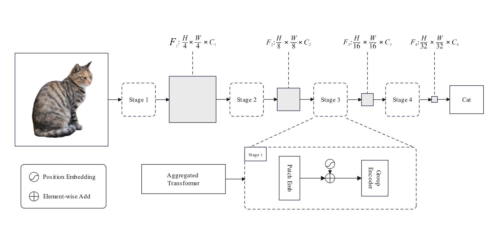
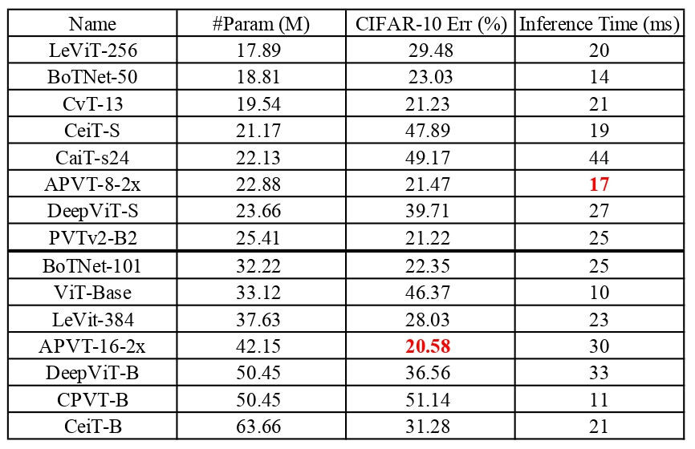
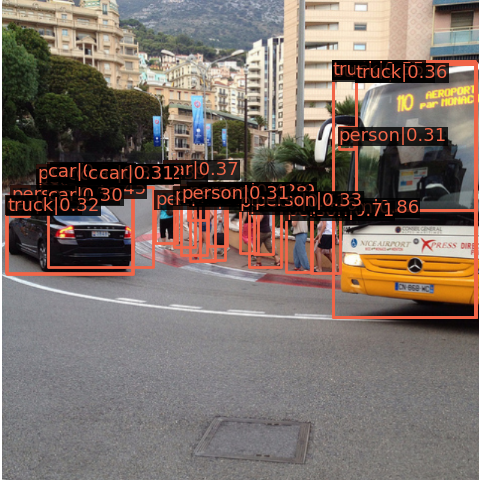
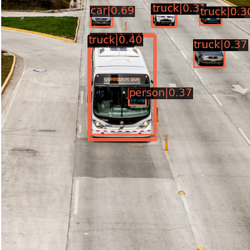

# Aggregated Pyramid Vision Transformer: Split-transform-merge Strategy for Image Recognition without Convolutions
### ！！！ APVT model code will be updated later  ！！！ [Paper](https://arxiv.org/abs/2203.00960)

  

## Image Classification
#### #Params tested by [OpCounter](https://github.com/Lyken17/pytorch-OpCounter)
#### CIFAR-10 tested by [Code](https://github.com/soapisnotfat/pytorch-cifar10)
#### Hyperparameters
- epochs 60
- initial lr = 5e-4
- batch size = 128
- optimizer = AdamW
- MultiStepLR = （[30,60], gamma=0.1）

  

## Object Detection
#### Method: RetinaNet, Epoch: 12 
#### Dataset: [COCO 2017](https://cocodataset.org/#download) 
#### Code by [mmdetection](https://github.com/open-mmlab/mmdetection)
#### result:
 Average Precision  (AP) @[ IoU=0.50:0.95 | area=   all | maxDets=100 ] = 0.168 
 
 Average Precision  (AP) @[ IoU=0.50      | area=   all | maxDets=1000 ] = 0.272
 
 Average Precision  (AP) @[ IoU=0.75      | area=   all | maxDets=1000 ] = 0.176
 
 Average Precision  (AP) @[ IoU=0.50:0.95 | area= small | maxDets=1000 ] = 0.087
 
 Average Precision  (AP) @[ IoU=0.50:0.95 | area=medium | maxDets=1000 ] = 0.179
 
 Average Precision  (AP) @[ IoU=0.50:0.95 | area= large | maxDets=1000 ] = 0.217
 
 Average Recall     (AR) @[ IoU=0.50:0.95 | area=   all | maxDets=100 ] = 0.379 
 
 Average Recall     (AR) @[ IoU=0.50:0.95 | area=   all | maxDets=300 ] = 0.379 
 
 Average Recall     (AR) @[ IoU=0.50:0.95 | area=   all | maxDets=1000 ] = 0.379
 
 Average Recall     (AR) @[ IoU=0.50:0.95 | area= small | maxDets=1000 ] = 0.192
 
 Average Recall     (AR) @[ IoU=0.50:0.95 | area=medium | maxDets=1000 ] = 0.397
 
 Average Recall     (AR) @[ IoU=0.50:0.95 | area= large | maxDets=1000 ] = 0.532
 
 #### eval:

  
  

## References
* [OpCounter](https://github.com/Lyken17/pytorch-OpCounter)
* [CIFAR-10](https://github.com/soapisnotfat/pytorch-cifar10)
* [mmdetection](https://github.com/open-mmlab/mmdetection)
